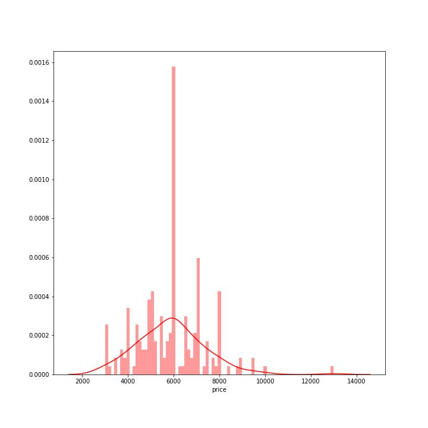
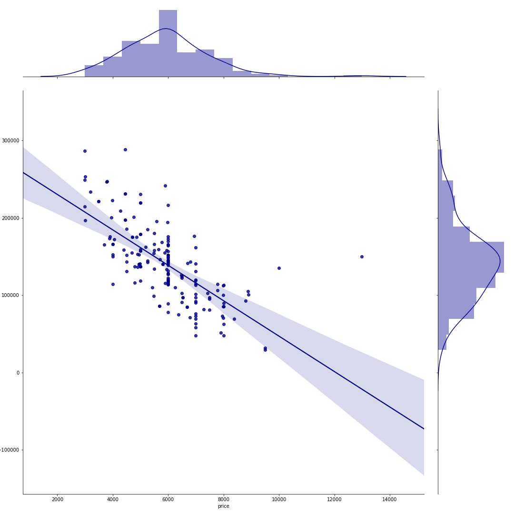
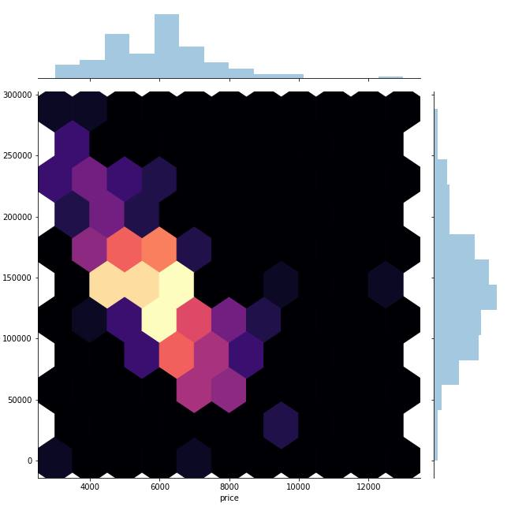

# Data Project #1 (Car Prices in 2018)

I was asked by someone to find out if the car they were getting was a good deal. I took all the 2005 Toyota Camrys and used the Mileage & Price as the metrics as one of the variables to make this determination.

After using a Javascript bookmarklet to acquire the data of hundreds of cars of that year + model, I made a simple histogram (w/ Kernel Density Estimation) to see how the price she was seeking measured up with general trends.

According to the histogram & KDE, it has peaked at $6000, and her deal is selling it for $5000 with 110000 miles. Visualizing data shows that she's not getting a raw deal by the trusted mechanic's auction.

After the histograph, I made a scatterplot & pretty heatmap to juxtapose mileage with the price, and look at general trends.





# Data Project #2 (NBA Draft & Stats in 2021)

I wanted to experiment with the AWS suite of Data Science Tools like AWS Glue, Kinesis Data Streams, Kinesis Firehose, Athena, S3, DynamoDB.,

To do this I needed to make some data sets. I thought about doing one for music, and also thought about NBA stats. My solution was to do it for the NBA player stats.

I made one dataset from Wikipedia where it held the information for where NBA players were drafted, and this was retrieved/scraped from Wikipedia, one of the world's ultimate data sources. The rest were NBA stats from 2020-21 that I simply easily downloaded from Kaggle.com.

I decided to make two datasets to put them in different places in Amazon, so I would use AWS Glue to combine the two, and use Athena for it, or use a Federated Query or some way to crossreference it.

The code to retrieve the data is in get_data.py

Unfortunately, I kept on getting "Zero Records Returned", even though I put down the S3 folder (not the file) in the AWS Glue Crawler, so I abandoned this quick project. I only did this to get a rudimentary feel for the Data part of the AWS Cloud anyway.

# Data Project #3 (Kinesis in Python in 2020)

I was just messing around with the Boto3 interface for Kinesis with Python to ingest data into a Kinesis stream.

```python
# To add a new cell, type '# %%'
# To add a new markdown cell, type '# %% [markdown]'
# %%
import boto3
from itertools import cycle
import os
import sys
import time
import random
import datetime
import time
from helpers import *
import json
# %%
stream_name = 'remove'
kinesis_client = boto3.client('kinesis', region_name='us-east-1')
kinesis_description = kinesis_client.describe_stream(StreamName=stream_name)
shard_id = kinesis_description.get("StreamDescription", {}).get("Shards", {})[
    0].get("ShardId", {})
# %%
def producer(*args, **kwargs):
    '''
    PRODUCER
    Note: I chose not to put this in it's own class.
    named_arguments:
    stream_name
    iterations
    delay_between_iterations
    '''
    stream_name = kwargs.get('stream_name', 'remove')
    iterations = kwargs.get('iterations', 5)
    delay_between_iterations = kwargs.get('delay_between_iterations', .01)
    count = 0
    cycle_generator = cycle("123456789")
    for number in cycle_generator:
        payload = {}
        payload['goon_value'] = number * random.randrange(1, 10)
        payload['timestamp'] = time.time()
        print(payload)
        time.sleep(delay_between_iterations)
        put_response = kinesis_client.put_record(
            StreamName=stream_name,
            Data=json.dumps(payload),
            PartitionKey=str(count))
        count = count + 1
        if count > iterations:
            break
# %%
def consumer(*args, **kwargs):
    iterations = kwargs.get('iterations', 2)
    limit = kwargs.get('limit', 1000)
    delay_between_iterations = kwargs.get('delay_between_iterations', 0)
    record_responses = []
    count = 0
    shard_iterator_response = kinesis_client.get_shard_iterator(
        StreamName=stream_name, ShardId=shard_id, ShardIteratorType='TRIM_HORIZON')
    shard_iterator = shard_iterator_response.get('ShardIterator', None)
    while count < iterations:
        record_response = kinesis_client.get_records(
            ShardIterator=shard_iterator, Limit=limit)
        shard_iterator = record_response.get("NextShardIterator", {})
        record_responses.append(record_response)
        count = count + 1
    return record_responses
record_responses = consumer()
# %%
first_record_data_bytes = record_responses[0]['Records'][0]['Data']
first_record_data = json.loads(first_record_data_bytes)
a = int(first_record_data['goon_value'])
b = a + 1111111
b
# %%
```

